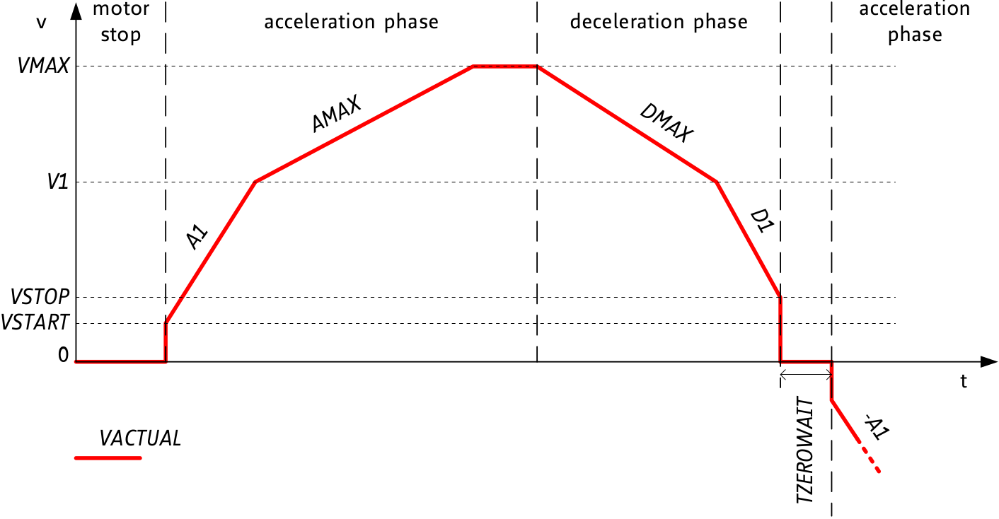

- [Library Information](#orgff0fe41)
- [Background](#orgb0abd37)
- [Host Computer Setup](#org3c6c683)

    <!-- This file is generated automatically from metadata -->
    <!-- File edits may be overwritten! -->


<a id="orgff0fe41"></a>

# Library Information

-   **Name:** ClusterController
-   **Version:** 4.3.0
-   **License:** BSD
-   **URL:** <https://github.com/janelia-arduino/ClusterController>
-   **Author:** Peter Polidoro
-   **Email:** peter@polidoro.io
-   **PCB:** <https://github.com/janelia-kicad/cluster-pcb>


## Description

Firmware for each cluster of prisms in the Voigts Lab honeycomb maze.


## Recommended Rig Settings

Validated single-cluster settings for the current rewrite bench and experimental-rig bring-up:

- home parameters:
  - `travel_limit = 100`
  - `max_velocity = 10`
  - `run_current = 43`
  - `stall_threshold = 0`
- controller parameters:
  - `start_velocity = 10`
  - `stop_velocity = 10`
  - `first_velocity = 40`
  - `max_velocity = 40`
  - `first_acceleration = 120`
  - `max_acceleration = 80`
  - `max_deceleration = 80`
  - `first_deceleration = 120`

Notes:

- Earlier GUI settings with `start_velocity = 20` and `stop_velocity = 20`
  were not reliable on the validated bench.
- The `travel_limit = 100` setting is a researcher-supervised incremental
  home, not a recovery home for an unknown physical state.
- Use ordinary repeated `100 mm` homing when a researcher is present at the
  rig. Use recovery homing only for rare fully automated preparation where one
  command must definitely home all prisms.
- Ordinary homing treats StallGuard as an early-stop hint, not unconditional
  proof of home. A stall is accepted only when the recorded home travel is
  within `2 mm` of the expected start position, or when the prism was already
  expected to be within `2 mm` of the hard stop. Implausible ordinary-home
  stalls continue through the bounded target-reached fallback.
- If the researcher can see that all prisms are physically on their hard stops,
  use `confirm-home-cluster` to zero positions without additional homing noise.
- Keep commanded positive prism positions clear of the mechanical positive
  hard stop on the real rig.
- Firmware clamps researcher-settable motion parameters before applying them
  and before reporting controller/current readback:
  - ordinary home travel: `1..100 mm`
  - recovery home travel: `1..550 mm`
  - home velocity: `4..12 mm/s`
  - home run current: `35..50%`
  - home StallGuard threshold: `-10..0`
  - normal run current: `40..75%`
  - normal start/stop velocity: `1..10 mm/s`
  - normal first velocity: `1..40 mm/s`, capped to `max_velocity`
  - normal max velocity: `10..40 mm/s`
  - normal first acceleration/deceleration: `20..120 mm/s/s`
  - normal max acceleration/deceleration: `20..80 mm/s/s`
  - normal target positions: `0..550 mm`


## Protocol

-   protocol-version = 0x06
-   prism-count = 7
-   command = protocol-version command-length command-number command-parameters
-   response = protocol-version response-length command-number response-parameters
-   duration units = ms
-   position units = mm
-   velocity units = mm/s
-   current units = percent
-   stall-threshold -> higher value = lower sensitivity, 0 indifferent value, 1..63 less sensitivity, -1..-64 higher sensitivity
-   home-parameters = travel-limit, max-velocity, run-current, stall-threshold
-   controller-parameters = start-velocity, stop-velocity, first-velocity, max-velocity, first-acceleration, max-acceleration, max-deceleration, first-deceleration
-   double-position = position-0, position-1
-   prism-diagnostics = health-flags, driver-flags, stall-guard-result, current-scale, last-home-travel-mm
-   diagnostic health flags: bit0 communicating, bit1 communication-failure-latched, bit2 reset-latched, bit3 driver-error-latched, bit4 charge-pump-undervoltage-latched, bit5 recovery-attempted-latched, bit6 recovery-failed-latched, bit7 mirror-resync-required
-   diagnostic driver flags: bit0 stallguard, bit1 over-temperature-warning, bit2 over-temperature-shutdown, bit3 short-to-ground-a, bit4 short-to-ground-b, bit5 open-load-a, bit6 open-load-b, bit7 standstill

| command-name                        | command-format       | command-length | command-number | command-parameters             | response-format | response-length | response-parameters    |
|----------------------------------- |-------------------- |-------------- |-------------- |------------------------------ |--------------- |--------------- |---------------------- |
| invalid-command                     |                      |                |                |                                | '<BBB'          | 3               | 0xEE                   |
| read-cluster-address                | '<BBB'               | 3              | 0x01           |                                | '<BBBB'         | 4               | 0x00..0xFF             |
| communicating-cluster               | '<BBB'               | 3              | 0x02           |                                | '<BBBL'         | 7               | 0x12345678             |
| reset-cluster                       | '<BBB'               | 3              | 0x03           |                                | '<BBB'          | 3               |                        |
| beep-cluster                        | '<BBBH'              | 5              | 0x04           | duration                       | '<BBB'          | 3               |                        |
| led-off-cluster                     | '<BBB'               | 3              | 0x05           |                                | '<BBB'          | 3               |                        |
| led-on-cluster                      | '<BBB'               | 3              | 0x06           |                                | '<BBB'          | 3               |                        |
| power-off-cluster                   | '<BBB'               | 3              | 0x07           |                                | '<BBB'          | 3               |                        |
| power-on-cluster                    | '<BBB'               | 3              | 0x08           |                                | '<BBB'          | 3               |                        |
| home-prism                          | '<BBBBHBBb'          | 9              | 0x09           | prism-address, home-parameters | '<BBBB'         | 4               | prism-address          |
| home-cluster                        | '<BBBHBBb'           | 8              | 0x0A           | home-parameters                | '<BBB'          | 3               |                        |
| homed-cluster                       | '<BBB'               | 3              | 0x0B           |                                | '<BBBBBBBBBB'   | 10              | 0..1[prism-count]      |
| write-target-prism                  | '<BBBBH'             | 6              | 0x0C           | prism-address, position        | '<BBBB'         | 4               | prism-address          |
| write-targets-cluster               | '<BBBHHHHHHH'        | 17             | 0x0D           | position[prism-count]          | '<BBB'          | 3               |                        |
| pause-prism                         | '<BBBB'              | 4              | 0x0E           | prism-address                  | '<BBBB'         | 4               | prism-address          |
| pause-cluster                       | '<BBB'               | 3              | 0x0F           |                                | '<BBB'          | 3               |                        |
| resume-prism                        | '<BBBB'              | 4              | 0x10           | prism-address                  | '<BBBB'         | 4               | prism-address          |
| resume-cluster                      | '<BBB'               | 3              | 0x11           |                                | '<BBB'          | 3               |                        |
| read-positions-cluster              | '<BBB'               | 3              | 0x12           |                                | '<BBBhhhhhhh'   | 17              | -1..32767[prism-count] |
| write-run-current-cluster           | '<BBBB'              | 4              | 0x13           | run-current                    | '<BBB'          | 3               |                        |
| read-run-current-cluster            | '<BBB'               | 3              | 0x14           |                                | '<BBBB'         | 4               | run-current            |
| write-controller-parameters-cluster | '<BBBBBBBBBBB'       | 11             | 0x15           | controller-parameters          | '<BBB'          | 3               |                        |
| read-controller-parameters-cluster  | '<BBB'               | 3              | 0x16           |                                | '<BBBBBBBBBBB'  | 11              | controller-parameters  |
| write-double-target-prism           | '<BBBBHH'            | 8              | 0x17           | prism-address, double-position | '<BBBB'         | 4               | prism-address          |
| write-double-targets-cluster        | '<BBBHHHHHHHHHHHHHH' | 31             | 0x18           | double-position[prism-count]   | '<BBB'          | 3               |                        |
| read-home-outcomes-cluster          | '<BBB'               | 3              | 0x19           |                                | '<BBBBBBBBBB'   | 10              | home-outcome[prism-count] |
| read-prism-diagnostics-cluster      | '<BBB'               | 3              | 0x1A           |                                | '<BBB...'       | 52              | prism-diagnostics[prism-count] |
| clear-prism-diagnostics-cluster     | '<BBB'               | 3              | 0x1B           |                                | '<BBB'          | 3               |                        |
| recovery-home-prism                 | '<BBBBHBBb'          | 9              | 0x1C           | prism-address, home-parameters | '<BBBB'         | 4               | prism-address          |
| recovery-home-cluster               | '<BBBHBBb'           | 8              | 0x1D           | home-parameters                | '<BBB'          | 3               |                        |
| confirm-home-prism                  | '<BBBB'              | 4              | 0x1E           | prism-address                  | '<BBBB'         | 4               | prism-address          |
| confirm-home-cluster                | '<BBB'               | 3              | 0x1F           |                                | '<BBB'          | 3               |                        |


<a id="orgb0abd37"></a>

# Background




<a id="org3c6c683"></a>

# Host Computer Setup


## Download this repository

<https://github.com/janelia-arduino/ClusterController.git>

```sh
git clone https://github.com/janelia-arduino/ClusterController.git
```


## PlatformIO


### Install PlatformIO Core

<https://docs.platformio.org/en/latest/core/installation/index.html>

```sh
python3 -m venv .venv
source .venv/bin/activate
pip install platformio
pio --version
```


### 99-platformio-udev.rules

Linux users have to install udev rules for PlatformIO supported boards/devices.

1.  Download udev rules file to /etc/udev/rules.d

    ```sh
    curl -fsSL https://raw.githubusercontent.com/platformio/platformio-core/develop/platformio/assets/system/99-platformio-udev.rules | sudo tee /etc/udev/rules.d/99-platformio-udev.rules
    ```

2.  Restart udev management tool

    ```sh
    sudo service udev restart
    ```

3.  Add user to groups

    ```sh
    sudo usermod -a -G dialout $USER && sudo usermod -a -G plugdev $USER
    ```

4.  Remove modemmanager

    ```sh
    sudo apt-get purge --auto-remove modemmanager
    ```

5.  After setting up rules and groups

    You will need to log out and log back in again (or reboot) for the user group changes to take effect.
    
    After this file is installed, physically unplug and reconnect your board.


### Compile the firmware

1.  Gnu/Linux

    ```sh
    pixi run build-rewrite
    ```

2.  Other

    ```sh
    PLATFORMIO_CORE_DIR=.platformio pio run -e pico-rewrite
    ```


### Upload the firmware

1.  Gnu/Linux

    ```sh
    pixi run flash-rewrite -- --upload-port COM3
    ```

2.  Other

    ```sh
    PLATFORMIO_CORE_DIR=.platformio pio run -e pico-rewrite -t upload
    ```


### Flash the prebuilt rewrite artifact

Use the committed UF2 artifact when you want to flash without rebuilding. On a
fresh machine, the task bootstraps the required `picotool` package into the
repo-local `.platformio/` directory automatically.

```sh
pixi run flash-artifact-rewrite
```

To target a specific attached board:

```sh
pixi run flash-artifact-rewrite -- --ser E6625CA5633BB039
```

If a controller is already running firmware with the Ethernet bootloader
command, put that cluster into BOOTSEL without physical access first:

```sh
pixi run maze reboot-bootloader-cluster 10
pixi run flash-artifact-rewrite -- --ser E6625CA5633BB039
```

Older firmware may still require the RP2040 1200-baud CDC touch or physical
BOOTSEL. On the full rig, the 1200-baud touch was not reliable until the USB
device was reset at the hub, so prefer the Ethernet bootloader command after
this firmware has been installed once.


### Serial Terminal Monitor

1.  Gnu/Linux

    ```sh
    pixi run monitor
    ```

2.  Other

    ```sh
    PLATFORMIO_CORE_DIR=.platformio pio device monitor --echo --eol=LF --baud 115200
    ```


## Arduino Ide


### Download

<https://www.arduino.cc/en/software>


### Additional Boards Manager URLs

File > Preferences

    https://github.com/earlephilhower/arduino-pico/releases/download/global/package_rp2040_index.json


### Add Board Support Packages

-   Raspberry Pi Pico/RP2040 by Earle F Philhower, III
